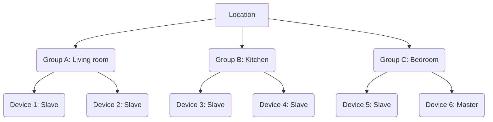

# i-Vent Smart Home Cloud API

This is the documentation for the cloud API for the i-Vent system. This document is intended to provide a high-level overview of the i-Vent system as well as providing specific implementation details to facilitate the creation of third-party i-Vent control software.

## The system

The i-Vent system is composed of i-Vent devices connected via Wi-Fi to each other. They connect to a common Wi-Fi point and communicate locally over UDP. They are organized into Locations and Groups. Each location also has one i-Vent device which is marked as a "Master". This device is responsible for keeping other devices in sync and communicating with the cloud server. It is also responsible for proxying certain requests between network participants (app and cloud) and the devices themselves.

### Example



This example of a Location shows one location, with 3 groups and 6 total i-Vent devices.


## Location

The location is the set of devices and groups unique to one organizational unit (a home, a business etc...). i-Vents belonging to one location communicate only with i-Vents of the same location. This is also true of the cloud API and of the mobile app. The process of gaining access to a location is done via a QR code in the app or via permission management on the web interface. Each location is primarily identified with the use of a location_id (a globally unique u64).

The set of actions available to users for a location are:
- Create a location
- Delete a location (lose access to it unless you have a QR code saved)
- Rename a location
- Add a device to the location (Pairing)

## Groups

Groups are a set of devices that work in unison to provide air circulation. Each group can have many i-Vent devices. Devices in a group share a synchronization timestamp with which they derive their working direction according to the [Airflow Formula](#airflow-formula).

The set of actions available to users for a group are:
- Create a group
- Delete a group (Master will automatically move all devices to Group_0, a special reserved undeletable group signifying devices without a group selected)
- Rename a group
- Move devices between groups
- Change the work mode or special mode

## Device

i-Vent devices can be paired to a location and added to/removed from groups.

## Airflow formula

The airflow direction formula allows devices to not constantly have to keep the app or other devices informed about the state of their blowing direction.

It is used in the Heat recovery and Bypass modes, just with a different duration(65s vs 30 min by default, respectively).

Here is how it works:

```c
uint64_t rotate_time = (remoteControlMessage.currentModeDurationIn + remoteControlMessage.currentModeDurationOut);

uint64_t offset= (current_time_utc_seconds - remoteControlMessage.workmode_changed_timestamp) - (deviceSettings.reverseFlow ? 5 : 0);

uint64_t place_in_period = offset % rotate_time;

if(place_in_period < groupSetting_TimeOut){
  //blow IN or FORWARD
}else{
  //blow OUT or REVERSE
}
```

This formula allows the UI to display the current direction of airflow without any network synchronization.

# Getting Started


## 1. Introduction to OpenAPI

If you’re new to OpenAPI, it’s a specification that allows you to describe RESTful APIs in a standardized format. Having an OpenAPI document, typically in JSON or YAML format, helps both humans and machines understand and interact with APIs through automatically generated code samples, documentation, and client libraries.

## 2. The `openapi.json` File

We’ve provided an `openapi.json` file that describes all the endpoints, parameters, request bodies, and responses for our API. This file is the foundation for generating client libraries.

## 3. Using OpenAPI Generator

[OpenAPI Generator](https://github.com/OpenAPITools/openapi-generator) is a powerful tool that can create client libraries in a variety of languages (Java, Python, JavaScript, Go, and many more) directly from an OpenAPI description. You can explore all available generators [here](https://openapi-generator.tech/docs/generators/).

### 3.1 Generating a Client Library

After installing OpenAPI Generator, you can generate client libraries from the provided `openapi.json`:

```bash
openapi-generator generate \
    -i path/to/openapi.json \
    -g <YOUR_LANGUAGE> \
    -o ./generated-client
```

In this command:

- `-i` specifies the input OpenAPI file (replace `path/to/openapi.json` with the actual path or URL to the file).
- `-g` indicates the target language or framework (e.g., `java`, `python`, `typescript-axios`, etc.).
- `-o` is the output directory where the generated client library will be placed.

## 4. Summary

1. **Install OpenAPI Generator** – Choose your preferred installation method and install the generator
2. **Generate your client library** – Use the `generate` command with the language of your choice.  
3. **Explore your new client library** – Navigate the `generated-client` folder, import it into your project, and start interacting with the API!

## 5. Using the API

Read the provided openapi specification and implement the endpoints in the `/live` section. An API key is required to make requests, this can be obtained from the web interface and is valid only for one location.

The endpoint `/live/{loc_id}/info` provides an overview of the system state and should be polled. 

The endpoint `/live/{loc_id}/modify_group` provides a way to send commands to a group (like remote control commands).